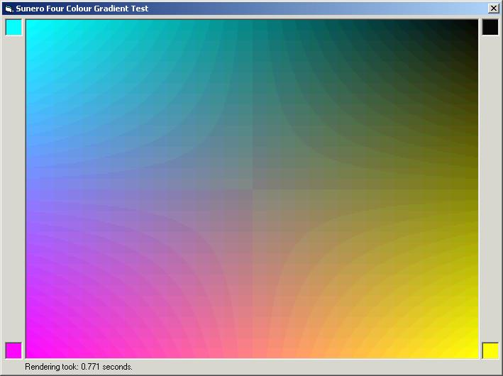



## Four Colour Gradient \(one on each corner, Updated with more examples\)

### Description

This module can draw a gradient with four colours, one on each corner. It is not really hard to draw such a gradient, only it is slow. As the loops get larger, the processing takes more time. Even if you use DIB sections, you still have to perform large loops, slowing down the performance. But, by this method, it is possible to eliminate the larger loops, hence increasing the performance manifold. On my PII 233 MHz, drawing a gradient of 640 * 480 took 0.771 (as seen in the screenshot) seconds in the IDE and 0.44 seconds on compiling. New examples include drawing of Hue/Blackness, Hue/Whiteness and Hue/Saturation (Like VB) colour models.
 
### More Info
 

             |
---                |---
**Submitted On**   |2002-08-03 21:42:06
**By**             |[Sunero Technologies](https://github.com/Planet-Source-Code/PSCIndex/blob/master/ByAuthor/sunero-technologies.md)
**Level**          |Advanced
**User Rating**    |4.9 (59 globes from 12 users)
**Compatibility**  |VB 5\.0, VB 6\.0
**Category**       |[Graphics](https://github.com/Planet-Source-Code/PSCIndex/blob/master/ByCategory/graphics__1-46.md)
**World**          |[Visual Basic](https://github.com/Planet-Source-Code/PSCIndex/blob/master/ByWorld/visual-basic.md)
**Archive File**   |[Four\_Colou707514102002\.zip](https://github.com/Planet-Source-Code/sunero-technologies-four-colour-gradient-one-on-each-corner-updated-with-more-examples__1-33627/archive/master.zip)

